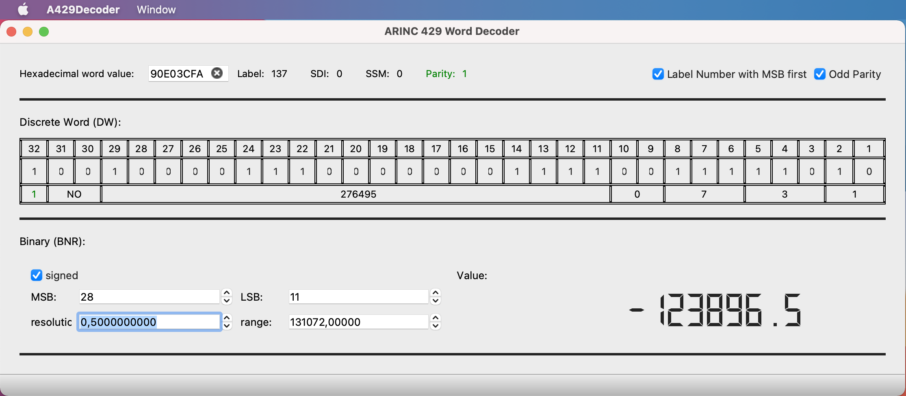

# A429Decoder

Simple application to encode and/or decode ARINC 429 32bit words.
In the current version, only DW and BNR formats are supported. BCD and ISO5 formats will be added later.

## Depedencies:
---------------

[KindVador/A429Library](https://github.com/KindVador/A429Library)
